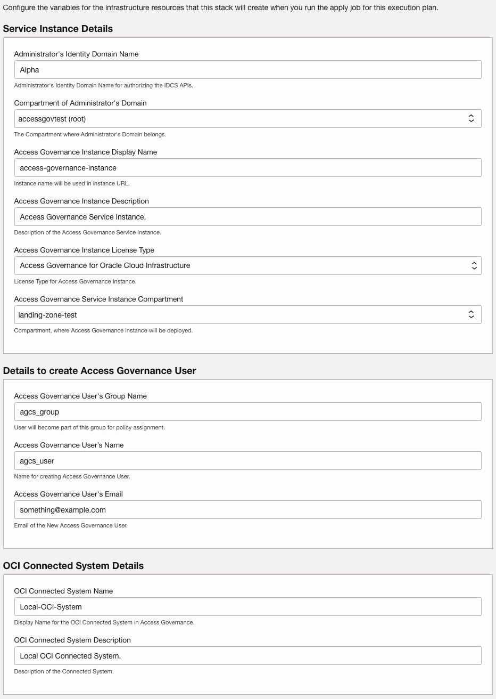

# Access Governance Stack

## Overview

The terraform code in this folder deploys Oracle Access Governance.  It is accomplished by deploying an Oracle Access Governance Instance, creating an Oracle Access Governance User and adding an OCI connected system. This workload supports only Identity Domain based OCI tenancies.

## Variables
| Variable Name                          | Description                                                                                                                                                         | Required | Default Value                       |
|----------------------------------------|---------------------------------------------------------------------------------------------------------------------------------------------------------------------|---------|-------------------------------------|
| **user_ocid**                          | OCID of the Administrator.                                                                                                                                          | Yes     | None                                |
| **fingerprint**                        | Fingerprint of the Administrator.                                                                                                                                   | Yes     | None                                |
| **tenancy_ocid**                       | OCID of the Administrator's Identity Domain Tenancy.                                                                                                                | Yes     | None                                |
| **region**                             | Region of the Administrator.                                                                                                                                        | Yes     | None                                |
| **private_key_path**                   | Private Key Path of Administrator.                                                                                                                                  | Yes     | None                                |
| **admin_domain_name**                  | Identity Domain Name where the administrator belongs.                                                                                                               | Yes     | Default                             |
| **admin_domain_compartment_ocid**      | Compartment where the Identity Domain of the administrator belongs.                                                                                                 | Yes     | None                                |
| **service_instance_compartment_ocid**  | Compartment OCID for Access Governance Instance.                                                                                                                    | Yes     | None                                |
| **service_instance_description**       | Access Governance Instance Description.                                                                                                                             | Yes     | Access Governance Service Instance. |
| **service_instance_display_name**      | Access Governance Instance Display Name.                                                                                                                            | Yes     | None                                |
| **ag_license_type**                    | Access Governance Instance License Type.  Supported license types are "Access Governance for Oracle Workloads", "Access Governance for Oracle Cloud Infrastructure" |Yes      | None                                |
| **use_existing_agcs_user**             | Set this value to either use existing Access Governance user or create new one.                                                                                     | No      | false                               |
| **agcs_user_name**                     | New Access Governance User's name.                                                                                                                                  | Yes     | None                                |
| **agcs_user_email**                    | Email address for the user.                                                                                                                                         | Yes     | None                                |
| **agcs_user_group_display_name**       | Group to create for Access Governance User.                                                                                                                         | Yes     | None                                |
| **agcs_user_ocid_oci_system**          | Access Governance User's OCID.                                                                                                                                      | Yes     | None                                |
| **agcs_user_private_key_path**         | Private Key for Access Governance User.                                                                                                                             | Yes     | None                                |
| **agcs_user_fingerprint_oci_system**   | Access Governance User's Fingerprint.                                                                                                                               | Yes     | None                                |
| **agcs_user_region_oci_system**        | Region of the Access Governance User.                                                                                                                               | Yes     | None                                |
| **agcs_user_tenancy_ocid_oci_system**  | Access Governance User's Tenancy OCID.                                                                                                                              | Yes     | None                                |
| **oci_system_description**             | OCI Connected System Description.                                                                                                                                   | Yes     | Local OCI Connected System.         |
| **oci_system_name**                    | OCI Connected System Name.                                                                                                                                          | Yes     | Local-OCI-System                    |

## How to execute
### Via Resource Manager
  
*If you are logged into your OCI tenancy, the button will take you directly to OCI Resource Manager where you can proceed to deploy. If you are not logged, the button takes you to Oracle Cloud initial page where you must enter your tenancy name and login to OCI.*
1. Accept the terms, click on checkbox <blockquote> <checkbox> I have reviewed and accept the Oracle Terms of Use </blockquote>
2. Click Next.
3. Enter the values for required variables.   

4. Click Next.
5. Click Next.
6. Click Apply.

### Via Terraform CLI
1. Change working directory to access-governance-tf-template.
2. Enter required variables in terraform.tfvars, for examples, refer examples/tfvars.
3. terraform init.
4. terraform plan.
5. terraform apply.

## License
Copyright (c) 2023, Oracle and/or its affiliates.

Licensed under the Universal Permissive License v 1.0 as shown at https://oss.oracle.com/licenses/upl.

See [LICENSE](LICENSE) for more details.

## Known Issues
None.